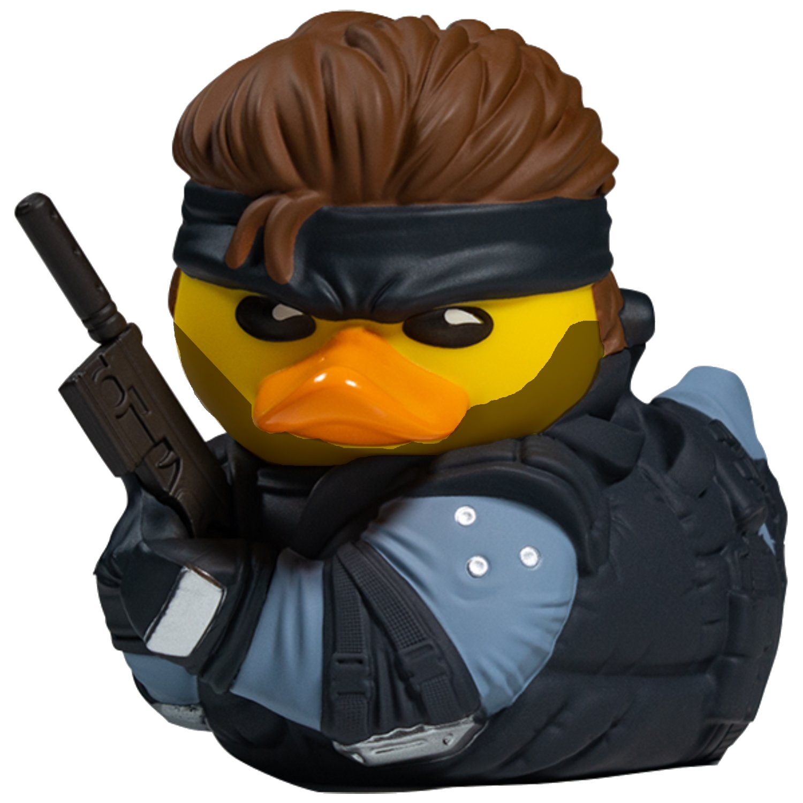

<h1 align='center'>
  <br>

  <br>
  Call of Coding: Fullstack Warfare
  </h1>

<p>
  Fullstack-Warfare is a educational game in which the user has the option of multilearning to fend off an evil army of ducks using JavaScript<p>

## Usage

* All users must sign up to gain access. Username and password required.
    
* Copy and paste the link below to begin learning.

```
https://fullstack-warfare.herokuapp.com/
```

## Why?

* We were all interested in designing a 'game'.
* We acknowledged that learning how to code offers very little gratification in the early stages.
* We wanted to explore outside of what technologies we were most comfortable with, i.e., the implementation of WebSockets, Animejs, and Monaco-Editor. 


## Key Features

* User gets an introduction to the basics of coding through an interactive exchange with General Joe.
* User begins implementing their understanding of control flow through the Monaco-Editor within the browser so their code can be tested.
* User cannot skip levels to ensure accumulative comprehension.
* User has the option of 'inviting' someone else to a room to help them solve the level.
* User can change their username or password.
* User progress get's tracked as they advance.


## Demo

* -GIFS OF WEBSITE ONCE OF SATISFACTION WILL GO HERE-

## Credits
1. Stephanie Durino
```
https://github.com/stephdurino
```
2. James Goering
```
https://github.com/James-goering
```
3. Andrew Kerr
```
https://github.com/ak373
```
4. Vaughn Pole
```
https://github.com/vjp2109
```
